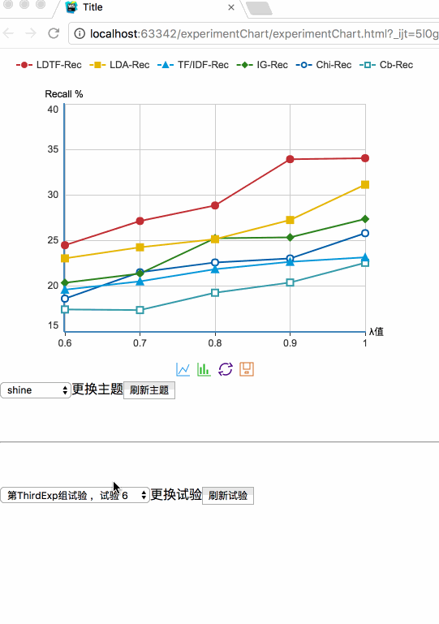

## 实验结画图插件

在实验室做论文实验的童靴们都知道，有一个高大上的实验结果图很重要呀，对于前端来说最常用就是echarts，但是一篇论文可能会做四到五个试验，对于我这种要写三个论文的人来说每个试验都要写一个option，特别是在论文演示的时候超级麻烦，要疯了！！于是我就写了一个小插件，
api也挺简单，只需要按照下面的🌰例子写好你的数据

```javascript
var lda={
        titleShow:false,  //是否展示是实验标题
        title:"文本分类",//实验标题
        subTitle:"TF/IDF,SVM",//试验副标题
        legendData:['TF/IDF','PG-TF/IDF'],//对比算法名称
        xTitle:"文本类别数量",//x轴标题
        yTitle:"分类准确度 %",//y轴标题
        XData:[3,4,5,6,7,8,9],//x轴数据
        seriers:[ //对应legendData，每条对比算法对应x轴数据的在y轴的值
            [90.14,82.05,81.99,81.0,78.4,76.5,75.8],
            [97.13,95.36,92.21,91.4,87.1,85.6,81.4],
        ],
        min:70,  //y轴数据范围，最小值
        max:100  //y轴数据范围，最大值
    };
  
```

然后在页面中引入`experimentChart.js`

```javascript
var expChart = new experimentChart(param1,param2,param3);
```

param1: 本次试验默认的主题  //不填默认grey

param2: 默认展示的实验组名//不填默认注册的第一组

param3: 默认展示实验组中的第几个试验//不填默认param实验组中的第一个试验。

然后注册你的实验数据吧：🙂

```javascript
	expChart.registerExperiment('firstExp',lda);
    expChart.registerExperiment('firstExp',tfidf);
    expChart.registerExperiment('firstExp',cbrec);
    expChart.registerExperiment('secondExp',svm);
	expChart.init('main');
```


```javascript
expChart.registerExperiment(param1,param2);
```

param1: 实验组名

param2: 试验的数据

一个实验组可注册对个试验

`expChart.init(param3);`

param3: 你需要图表出现的容器id

然后就完成啦，☺️




